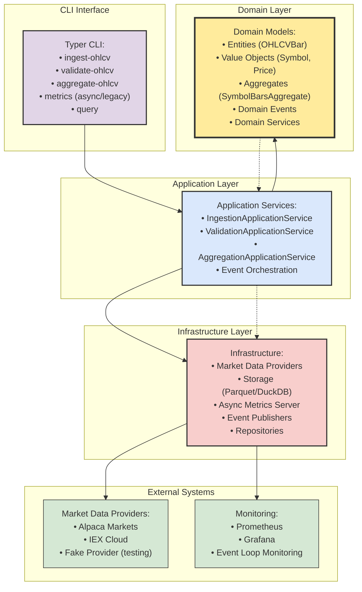

# MarketPipe (MarketPype)

[](docs/pipeline.md#metrics)


### MarketPipe: ETL That Understands Markets

**MarketPipe** is the open-source ETL and data management toolkit for time-series financial data. Built for Python developers, quant researchers, and small teams, MarketPipe bridges the gap between notebook "hacks" and full-blown enterprise platforms—giving you:

* **Reliable ingestion** from multiple providers (Alpaca, IEX, with more on the way)
* **Async, parallel processing**—process hundreds of symbols concurrently with checkpointing and resumption
* **Pluggable provider architecture**—easily swap or add new data sources
* **Universe management**—define, filter, and update your trading universe (domain logic in place; CLI integration coming soon)
* **Modern storage**—fast Parquet files, DuckDB-powered views, and SQL/CLI querying out of the box
* **Event-driven validation**—built-in rules and CSV audit reports to catch bad data before it hits your models
* **Async metrics server**—non-blocking Prometheus metrics with event loop lag monitoring and legacy compatibility
* **Monitoring and metrics**—Prometheus integration, event-driven metrics collection, and CLI metrics commands
* **Secure by design**—utilities to mask secrets in logs and support for safe connection handling
* **Thorough testing**—all major commands regression tested, with coverage and CI built-in

#### Roadmap Highlights

MarketPipe is moving fast, and here's what's next:

* Full CLI support for universe management, CSV exports, and dynamic symbol filtering
* One-shot backfill, pruning, and retention commands to automate your data hygiene
* Config versioning, enhanced async metrics server, and a pluggable scheduler for automation
* Expanding data sources: Finnhub, Polygon, and multi-provider reconciliation with a feature matrix
* API docs for all core domain models and comprehensive CLI reference

#### Why MarketPipe?

**No more glue code. No more fragile scripts.**
MarketPipe is for everyone who's tired of rolling their own one-off data jobs—and everyone who knows that notebooks and ad hoc scripts won't scale when real money is on the line.
It's open, hackable, and designed to be dropped into your stack—run it locally or in the cloud, and extend it as your needs grow.

## About MarketPipe

**MarketPipe** is a modern, Python-native ETL framework purpose-built for financial market data workflows. Designed for speed, flexibility, and clarity, MarketPipe puts you in control—whether you're building your own trading stack, wrangling market data for analytics, or managing multiple data sources across asset classes.

With a foundation in Domain-Driven Design (DDD) and an intuitive CLI-first interface, MarketPipe gives you rock-solid ingestion, transformation, and validation—without the heavyweight baggage of legacy pipeline tools. Use it locally, scale up to the cloud, or plug into your research, backtesting, or operational data workflows.

## Architecture Overview

MarketPipe follows Domain-Driven Design with clear separation between domain logic, application services, and infrastructure concerns:



## Installation

```bash
pip install -e .
```

## Usage

### Initialization

MarketPipe uses lazy initialization to avoid side-effects when importing the CLI module. Database migrations and service registration only occur when you run actual commands (not when checking help text or running tests).

```bash
# This does NOT create any database files or run migrations
marketpipe --help
python -c "import marketpipe.cli"

# These commands DO trigger initialization and database setup
marketpipe ingest --symbols AAPL --start 2024-01-01 --end 2024-01-02
marketpipe validate --list
marketpipe metrics --port 8000
```

The bootstrap process runs automatically and is idempotent - multiple commands in the same process will share the same initialized state.

### Available Providers

First, check what providers are available:

```bash
# List all registered providers
marketpipe providers
```

### Running an ingestion job

MarketPipe supports direct CLI flag usage with multiple providers:

```bash
# Using fake provider (generates synthetic data)
marketpipe ingest --provider fake --symbols TEST --start 2024-01-01 --end 2024-01-02 --batch-size 10

# Using Alpaca provider (requires ALPACA_KEY and ALPACA_SECRET env vars)
marketpipe ingest --provider alpaca --symbols AAPL,MSFT --start 2024-01-01 --end 2024-01-02 --batch-size 1000

# Using IEX provider (requires IEX_TOKEN env var)
marketpipe ingest --provider iex --symbols AAPL --start 2024-01-01 --end 2024-01-02 --batch-size 500
```

#### Configuration options

- `--provider`: Market data provider (`fake`, `alpaca`, `iex`)
- `--symbols`: Comma-separated list of stock symbols (e.g., AAPL,MSFT)  
- `--start`: Start date in YYYY-MM-DD format
- `--end`: End date in YYYY-MM-DD format
- `--batch-size`: Number of bars per API request (default: 1000)
- `--output`: Output directory for data files (default: ./data)
- `--workers`: Number of worker threads (default: 4)

### Metrics and Monitoring

MarketPipe includes a built-in async metrics server for Prometheus monitoring:

```bash
# Start async metrics server (default, non-blocking)
marketpipe metrics --port 8000

# Start legacy blocking metrics server
marketpipe metrics --port 8000 --legacy-metrics

# View metrics history and analytics
marketpipe metrics --list                    # List available metrics
marketpipe metrics --metric ingestion_bars   # Show metric history
marketpipe metrics --avg 1h --plot           # Show hourly averages with ASCII plot
```

#### Metrics Available

The async metrics server provides comprehensive monitoring:

- **Request metrics**: `mp_requests_total`, `mp_errors_total`, `mp_request_latency_seconds`
- **Event loop monitoring**: `marketpipe_event_loop_lag_seconds` (async server only)
- **Ingestion metrics**: `mp_ingest_rows_total`, `mp_validation_errors_total`
- **Processing metrics**: `mp_processing_time_seconds`, `mp_rate_limiter_waits_total`

#### Docker Compose Setup

Use the included `docker-compose.yml` for a complete monitoring stack:

```bash
# Start MarketPipe with Prometheus and Grafana
docker-compose up -d

# Access services
# MarketPipe metrics: http://localhost:8000/metrics
# Prometheus: http://localhost:9090
# Grafana: http://localhost:3000 (admin/admin)
```

#### Grafana Dashboard

Import the included dashboard from `grafana/marketpipe_dashboard.json` to visualize:

- Request rates and error rates by provider
- Event loop lag monitoring (async server)
- Ingestion throughput and validation errors
- Rate limiter activity and processing times

Environment variables for metrics configuration:

- `METRICS_PORT`: Port for metrics server (default: 8000)
- `METRICS_MAX_CONNECTIONS`: Maximum concurrent connections for async server (default: 100)
- `METRICS_MAX_HEADER_SIZE`: Maximum HTTP header size in bytes (default: 16384)
- `PROMETHEUS_MULTIPROC_DIR`: Directory for multiprocess metrics

### Other Commands

```bash
# Validate ingested data
marketpipe validate

# Run ad-hoc queries on stored data
marketpipe query

# Aggregate data to different timeframes
marketpipe aggregate

# Apply database migrations
marketpipe migrate
```

### General help

```bash
marketpipe --help
marketpipe ingest --help
marketpipe metrics --help
```

## Architecture Benefits

The Domain-Driven Design architecture provides:

- **Clean Separation**: Domain logic isolated from infrastructure concerns
- **Testability**: Pure domain models with comprehensive test coverage
- **Maintainability**: Clear boundaries between layers prevent coupling
- **Extensibility**: New providers and features can be added without affecting core domain
- **Async Monitoring**: Non-blocking metrics server with event loop lag detection
- **Monitoring**: Built-in metrics and event-driven architecture for observability

## License

MarketPipe is licensed under the Apache License, Version 2.0. See [LICENSE](LICENSE) for the full license text.

The Apache 2.0 license permits commercial use, including the development of closed-source plugins, user interfaces, and hosted services based on this codebase. This enables flexible monetization strategies while keeping the core framework open source.
