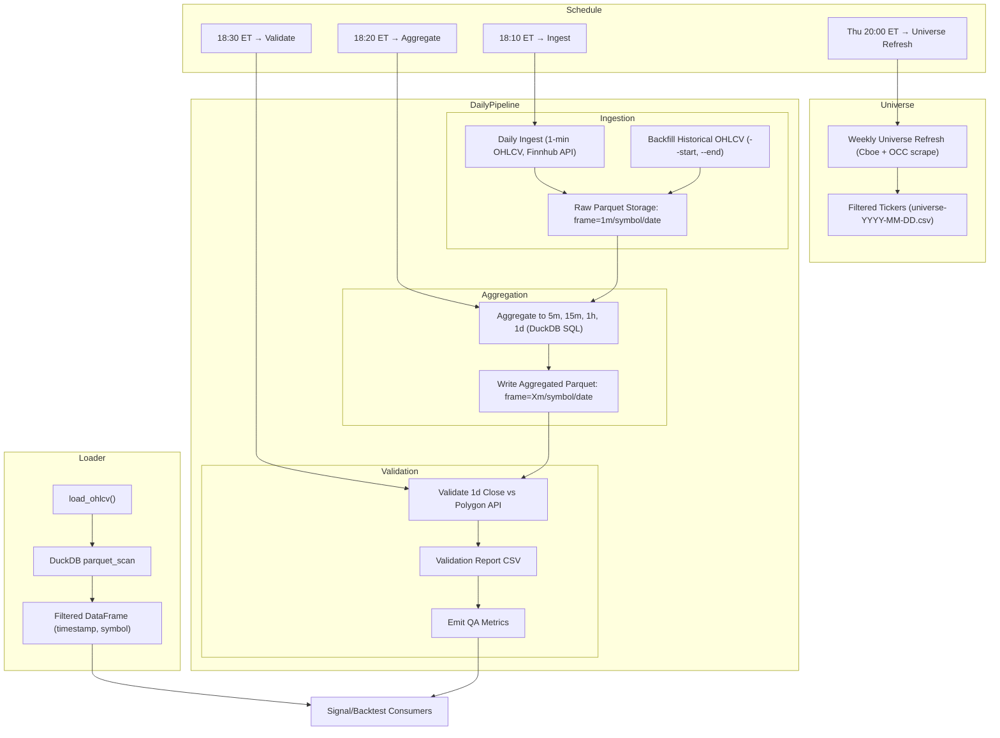

# MarketPipe

MarketPipe is a lightweight, Python-native ETL framework focused on time
series market data.  It aims to provide a simple command line interface
for ingesting, aggregating and validating OHLCV data with baked in
DuckDB/Parquet storage.  The project is still in early scaffolding.



## Installation

```bash
pip install -e .
```

## Usage

```bash
marketpipe --help
```
