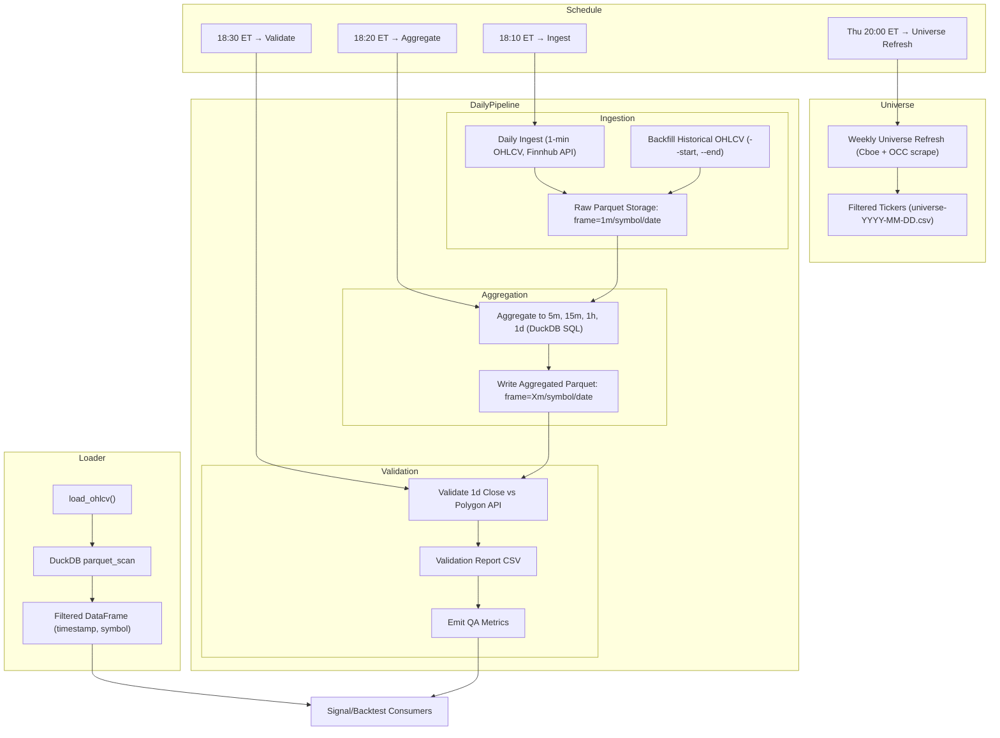

# MarketPipe (MarketPype)

[](docs/pipeline.md#metrics)


MarketPipe is a lightweight, Python-native ETL framework focused on time
series market data.  It aims to provide a simple command line interface
for ingesting, aggregating and validating OHLCV data with baked in
DuckDB/Parquet storage.  The project is still in early scaffolding.



## Installation

```bash
pip install -e .
```

## Usage

### Running an ingestion job

MarketPipe supports two ways to configure ingestion jobs:

#### Option 1: Using YAML configuration file

```bash
# Basic usage with config file
marketpipe ingest --config examples/config/ingestion_example.yaml

# Override specific settings from config file
marketpipe ingest --config examples/config/ingestion_example.yaml --batch-size 500 --workers 8
```

#### Option 2: Using direct CLI flags

```bash
# Direct flag usage
marketpipe ingest --symbols AAPL,MSFT,NVDA --start 2025-01-01 --end 2025-01-07 --batch-size 1000
```

#### Configuration options

- `--config`: Path to YAML configuration file
- `--symbols`: Comma-separated list of stock symbols (e.g., AAPL,MSFT)  
- `--start`: Start date in YYYY-MM-DD format
- `--end`: End date in YYYY-MM-DD format
- `--batch-size`: Number of bars per API request (default: 1000)
- `--output`: Output directory for data files (default: ./data)
- `--workers`: Number of worker threads (default: 4)
- `--provider`: Market data provider (default: alpaca)
- `--feed-type`: Data feed type - 'iex' for free, 'sip' for paid (default: iex)

### Starting metrics server

```bash
# Start Prometheus metrics server
marketpipe metrics --port 8000
```

### General help

```bash
marketpipe --help
marketpipe ingest --help
```

## License

MarketPipe is licensed under the Apache License, Version 2.0. See [LICENSE](LICENSE) for the full license text.

The Apache 2.0 license permits commercial use, including the development of closed-source plugins, user interfaces, and hosted services based on this codebase. This enables flexible monetization strategies while keeping the core framework open source.
