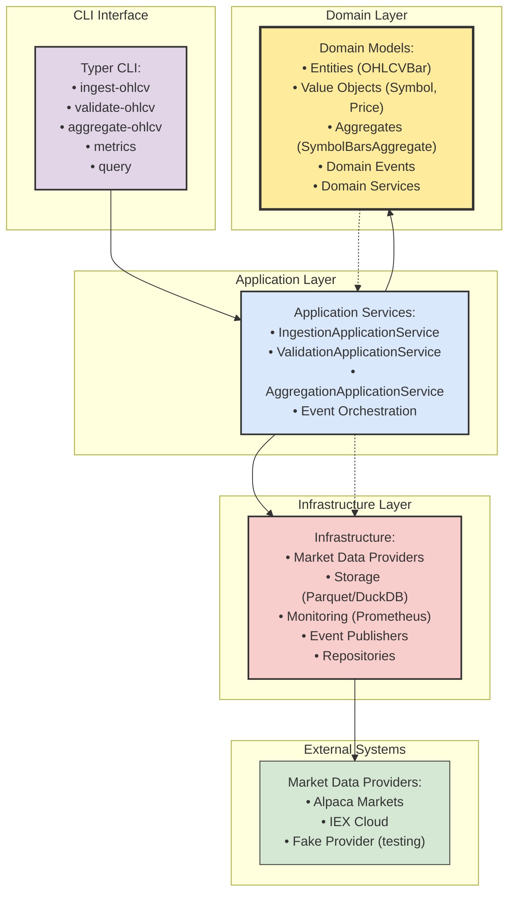

# MarketPipe (MarketPype)

[](docs/pipeline.md#metrics)


MarketPipe is a lightweight, Python-native ETL framework focused on time
series market data, built with Domain-Driven Design (DDD) principles.  
It provides a simple command line interface for ingesting, aggregating and 
validating OHLCV data with baked-in DuckDB/Parquet storage and comprehensive 
monitoring capabilities.

## Architecture Overview

MarketPipe follows Domain-Driven Design with clear separation between domain logic, application services, and infrastructure concerns:



## Installation

```bash
pip install -e .
```

## Usage

### Initialization

MarketPipe uses lazy initialization to avoid side-effects when importing the CLI module. Database migrations and service registration only occur when you run actual commands (not when checking help text or running tests).

```bash
# This does NOT create any database files or run migrations
marketpipe --help
python -c "import marketpipe.cli"

# These commands DO trigger initialization and database setup
marketpipe ingest --symbols AAPL --start 2024-01-01 --end 2024-01-02
marketpipe validate --list
marketpipe metrics --port 8000
```

The bootstrap process runs automatically and is idempotent - multiple commands in the same process will share the same initialized state.

### Available Providers

First, check what providers are available:

```bash
# List all registered providers
marketpipe providers
```

### Running an ingestion job

MarketPipe supports direct CLI flag usage with multiple providers:

```bash
# Using fake provider (generates synthetic data)
marketpipe ingest --provider fake --symbols TEST --start 2024-01-01 --end 2024-01-02 --batch-size 10

# Using Alpaca provider (requires ALPACA_KEY and ALPACA_SECRET env vars)
marketpipe ingest --provider alpaca --symbols AAPL,MSFT --start 2024-01-01 --end 2024-01-02 --batch-size 1000

# Using IEX provider (requires IEX_TOKEN env var)
marketpipe ingest --provider iex --symbols AAPL --start 2024-01-01 --end 2024-01-02 --batch-size 500
```

#### Configuration options

- `--provider`: Market data provider (`fake`, `alpaca`, `iex`)
- `--symbols`: Comma-separated list of stock symbols (e.g., AAPL,MSFT)  
- `--start`: Start date in YYYY-MM-DD format
- `--end`: End date in YYYY-MM-DD format
- `--batch-size`: Number of bars per API request (default: 1000)
- `--output`: Output directory for data files (default: ./data)
- `--workers`: Number of worker threads (default: 4)

### Other Commands

```bash
# Validate ingested data
marketpipe validate

# Run ad-hoc queries on stored data
marketpipe query

# Aggregate data to different timeframes
marketpipe aggregate

# Start Prometheus metrics server
marketpipe metrics --port 8000

# Apply database migrations
marketpipe migrate
```

### General help

```bash
marketpipe --help
marketpipe ingest --help
```

## Architecture Benefits

The Domain-Driven Design architecture provides:

- **Clean Separation**: Domain logic isolated from infrastructure concerns
- **Testability**: Pure domain models with comprehensive test coverage
- **Maintainability**: Clear boundaries between layers prevent coupling
- **Extensibility**: New providers and features can be added without affecting core domain
- **Monitoring**: Built-in metrics and event-driven architecture for observability

## License

MarketPipe is licensed under the Apache License, Version 2.0. See [LICENSE](LICENSE) for the full license text.

The Apache 2.0 license permits commercial use, including the development of closed-source plugins, user interfaces, and hosted services based on this codebase. This enables flexible monetization strategies while keeping the core framework open source.
