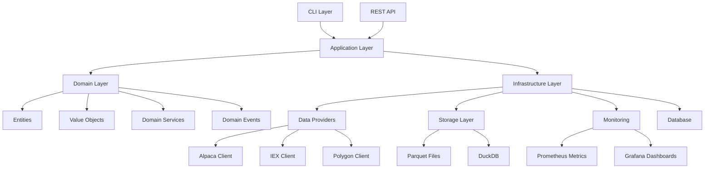

# Architecture Guide

This guide provides a comprehensive overview of MarketPipe's architecture, design patterns, and key architectural decisions. Understanding this architecture is essential for contributors and anyone looking to extend or integrate with MarketPipe.

## System Overview

MarketPipe is a modern, Python-native ETL framework designed specifically for financial market data workflows. It follows Domain-Driven Design (DDD) principles and implements a layered architecture with clear separation of concerns.

### Core Design Principles

1. **Domain-Driven Design**: Business logic is separated from infrastructure concerns
2. **Clean Architecture**: Dependencies flow inward toward the domain layer
3. **CQRS Pattern**: Separate read and write operations for optimal performance
4. **Event-Driven Architecture**: Loose coupling through domain events
5. **Plugin Architecture**: Extensible provider system for new data sources
6. **Async/Sync Dual APIs**: Support for both synchronous and asynchronous operations

## System Architecture Diagram



## Layer Architecture

### 1. Interface Layer (CLI/API)

The interface layer handles external interactions and user interfaces.

**Components:**
- `cli.py` - Typer-based command-line interface
- Future: REST API endpoints
- Future: WebSocket API for real-time data

**Responsibilities:**
- Command parsing and validation
- User input/output formatting
- Error handling and user feedback
- Authentication and authorization

**Example:**
```python
# src/marketpipe/cli.py
import typer
from .application.ingestion_service import IngestionService

app = typer.Typer()

@app.command()
def ingest(
    symbol: str = typer.Option(..., help="Stock symbol to ingest"),
    start_date: str = typer.Option(..., help="Start date (YYYY-MM-DD)"),
    end_date: str = typer.Option(..., help="End date (YYYY-MM-DD)")
):
    """Ingest market data for specified symbol and date range."""
    service = IngestionService()
    result = service.ingest_symbol_data(symbol, start_date, end_date)

    if result.success:
        typer.echo(f"✅ Ingested {result.records_processed} records")
    else:
        typer.echo(f"❌ Ingestion failed: {result.error_message}")
```

### 2. Application Layer (Use Cases)

The application layer orchestrates business workflows and coordinates between domain and infrastructure layers.

**Components:**
- `IngestionService` - Orchestrates data ingestion workflows
- `ValidationService` - Coordinates data validation
- `QueryService` - Handles data query operations
- `MonitoringService` - Manages system monitoring

**Responsibilities:**
- Use case orchestration
- Transaction management
- Event publishing
- Cross-cutting concerns (logging, metrics)

**Example:**
```python
# src/marketpipe/application/ingestion_service.py
from dataclasses import dataclass
from typing import List
from ..domain.entities import Symbol, OHLCVBar
from ..domain.repositories import IOHLCVRepository
from ..infrastructure.providers import IMarketDataProvider

@dataclass
class IngestionResult:
    """Result of an ingestion operation."""
    success: bool
    records_processed: int
    error_message: str = ""

class IngestionService:
    """Application service for data ingestion workflows."""

    def __init__(
        self,
        provider: IMarketDataProvider,
        repository: IOHLCVRepository,
        event_publisher: IEventPublisher
    ):
        self.provider = provider
        self.repository = repository
        self.event_publisher = event_publisher

    def ingest_symbol_data(
        self,
        symbol: str,
        start_date: str,
        end_date: str
    ) -> IngestionResult:
        """Orchestrate symbol data ingestion workflow."""
        try:
            # Convert to domain objects
            symbol_vo = Symbol(symbol)
            date_range = DateRange.from_strings(start_date, end_date)

            # Fetch raw data from provider
            raw_data = self.provider.fetch_ohlcv_data(symbol_vo, date_range)

            # Convert to domain entities
            bars = [self._to_domain_entity(data) for data in raw_data]

            # Store in repository
            self.repository.save_bars(bars)

            # Publish domain event
            event = DataIngestedEvent(symbol_vo, len(bars))
            self.event_publisher.publish(event)

            return IngestionResult(True, len(bars))

        except Exception as e:
            return IngestionResult(False, 0, str(e))
```

### 3. Domain Layer (Business Logic)

The domain layer contains the core business logic and rules, independent of external concerns.

**Components:**

#### Entities
```python
# src/marketpipe/domain/entities.py
from dataclasses import dataclass
from typing import Optional
from uuid import UUID, uuid4

class Entity:
    """Base class for all domain entities."""

    def __init__(self, id: Optional[UUID] = None):
        self.id = id or uuid4()
        self.version = 1

class OHLCVBar(Entity):
    """OHLCV bar with business rules and behavior."""

    def __init__(
        self,
        symbol: Symbol,
        timestamp: Timestamp,
        open_price: Price,
        high_price: Price,
        low_price: Price,
        close_price: Price,
        volume: Volume,
        id: Optional[UUID] = None
    ):
        super().__init__(id)
        self.symbol = symbol
        self.timestamp = timestamp
        self.open_price = open_price
        self.high_price = high_price
        self.low_price = low_price
        self.close_price = close_price
        self.volume = volume

        # Domain invariant validation
        self._validate_ohlc_consistency()

    def _validate_ohlc_consistency(self) -> None:
        """Ensure OHLC prices are consistent."""
        if not (self.high_price >= self.open_price and
                self.high_price >= self.close_price and
                self.high_price >= self.low_price and
                self.low_price <= self.open_price and
                self.low_price <= self.close_price):
            raise DomainError("OHLC prices are inconsistent")

    def calculate_true_range(self, previous_bar: 'OHLCVBar') -> Price:
        """Calculate True Range indicator."""
        high_low = self.high_price - self.low_price
        high_prev_close = abs(self.high_price - previous_bar.close_price)
        low_prev_close = abs(self.low_price - previous_bar.close_price)

        return max(high_low, high_prev_close, low_prev_close)
```

#### Value Objects
```python
# src/marketpipe/domain/value_objects.py
from dataclasses import dataclass
from decimal import Decimal
from datetime import datetime, timezone

@dataclass(frozen=True)
class Symbol:
    """Stock symbol value object."""
    value: str

    def __post_init__(self):
        if not self.value or not self.value.isalpha():
            raise ValueError(f"Invalid symbol: {self.value}")
        if len(self.value) > 10:
            raise ValueError(f"Symbol too long: {self.value}")

@dataclass(frozen=True)
class Price:
    """Monetary price with financial precision."""
    value: Decimal

    def __post_init__(self):
        if self.value < 0:
            raise ValueError("Price cannot be negative")

    @classmethod
    def from_float(cls, value: float) -> 'Price':
        return cls(Decimal(str(value)).quantize(Decimal('0.0001')))

@dataclass(frozen=True)
class Timestamp:
    """Timezone-aware timestamp."""
    value: datetime

    def __post_init__(self):
        if self.value.tzinfo is None:
            object.__setattr__(self, 'value', self.value.replace(tzinfo=timezone.utc))

    def to_nanoseconds(self) -> int:
        """Convert to nanoseconds for Arrow compatibility."""
        return int(self.value.timestamp() * 1_000_000_000)
```

#### Aggregates
```python
# src/marketpipe/domain/aggregates.py
from typing import List, Dict
from .entities import OHLCVBar
from .value_objects import Symbol, Timestamp
from .events import DomainEvent

class SymbolBarsAggregate:
    """Aggregate for managing OHLCV bars for a single symbol."""

    def __init__(self, symbol: Symbol):
        self.symbol = symbol
        self._bars: Dict[Timestamp, OHLCVBar] = {}
        self._events: List[DomainEvent] = []
        self.version = 1

    def add_bar(self, bar: OHLCVBar) -> None:
        """Add bar with aggregate consistency checks."""
        if bar.symbol != self.symbol:
            raise DomainError(f"Bar symbol {bar.symbol} doesn't match aggregate {self.symbol}")

        if bar.timestamp in self._bars:
            raise DomainError(f"Bar already exists for {bar.timestamp}")

        self._bars[bar.timestamp] = bar
        self.version += 1

        # Raise domain event
        self._events.append(BarAddedEvent(self.symbol, bar.timestamp))

    def get_bars_in_range(self, start: Timestamp, end: Timestamp) -> List[OHLCVBar]:
        """Get bars within timestamp range."""
        return [
            bar for timestamp, bar in self._bars.items()
            if start <= timestamp <= end
        ]

    def calculate_daily_summary(self, date: date) -> DailySummary:
        """Calculate daily OHLCV summary."""
        daily_bars = [
            bar for bar in self._bars.values()
            if bar.timestamp.value.date() == date
        ]

        if not daily_bars:
            raise DomainError(f"No bars found for {date}")

        daily_bars.sort(key=lambda b: b.timestamp.value)

        return DailySummary(
            symbol=self.symbol,
            date=date,
            open_price=daily_bars[0].open_price,
            high_price=max(b.high_price for b in daily_bars),
            low_price=min(b.low_price for b in daily_bars),
            close_price=daily_bars[-1].close_price,
            volume=sum(b.volume for b in daily_bars)
        )
```

#### Domain Events
```python
# src/marketpipe/domain/events.py
from dataclasses import dataclass
from datetime import datetime, timezone
from uuid import UUID, uuid4
from .value_objects import Symbol, Timestamp

class DomainEvent:
    """Base class for domain events."""

    def __init__(self):
        self.event_id = uuid4()
        self.occurred_at = datetime.now(timezone.utc)

@dataclass
class BarAddedEvent(DomainEvent):
    """Event raised when a new bar is added to aggregate."""
    symbol: Symbol
    timestamp: Timestamp

@dataclass
class DataIngestedEvent(DomainEvent):
    """Event raised when data ingestion completes."""
    symbol: Symbol
    bar_count: int

@dataclass
class ValidationFailedEvent(DomainEvent):
    """Event raised when data validation fails."""
    symbol: Symbol
    error_message: str
```

### 4. Infrastructure Layer

The infrastructure layer handles external integrations and technical concerns.

**Components:**

#### Data Providers
```python
# src/marketpipe/infrastructure/providers/alpaca_provider.py
from abc import ABC, abstractmethod
from typing import List, Dict, Any
from ...domain.value_objects import Symbol, DateRange
from ...domain.repositories import IMarketDataProvider

class AlpacaProvider(IMarketDataProvider):
    """Alpaca Markets data provider implementation."""

    def __init__(self, config: AlpacaConfig, http_client: HttpClient):
        self.config = config
        self.http_client = http_client

    def fetch_ohlcv_data(
        self,
        symbol: Symbol,
        date_range: DateRange
    ) -> List[Dict[str, Any]]:
        """Fetch OHLCV data from Alpaca API."""
        params = {
            'symbols': symbol.value,
            'start': date_range.start.isoformat(),
            'end': date_range.end.isoformat(),
            'timeframe': '1Min'
        }

        response = self.http_client.get(
            f"{self.config.base_url}/stocks/bars",
            params=params,
            headers=self._get_auth_headers()
        )

        return self._transform_response(response.json())

    def _get_auth_headers(self) -> Dict[str, str]:
        return {
            'APCA-API-KEY-ID': self.config.api_key,
            'APCA-API-SECRET-KEY': self.config.secret
        }

    def _transform_response(self, raw_data: Dict[str, Any]) -> List[Dict[str, Any]]:
        """Transform Alpaca response to canonical format."""
        # Implementation details...
        pass
```

#### Storage Layer
```python
# src/marketpipe/infrastructure/storage/parquet_storage.py
import pyarrow as pa
import pyarrow.parquet as pq
from pathlib import Path
from typing import List
from ...domain.entities import OHLCVBar
from ...domain.repositories import IOHLCVRepository

class ParquetStorage(IOHLCVRepository):
    """Parquet-based storage implementation."""

    def __init__(self, base_path: Path):
        self.base_path = base_path

    def save_bars(self, bars: List[OHLCVBar]) -> None:
        """Save bars to partitioned Parquet files."""
        if not bars:
            return

        # Group by symbol and date for partitioning
        partitions = self._partition_bars(bars)

        for partition_key, partition_bars in partitions.items():
            self._write_partition(partition_key, partition_bars)

    def _partition_bars(self, bars: List[OHLCVBar]) -> Dict[str, List[OHLCVBar]]:
        """Partition bars by symbol and date."""
        partitions = {}
        for bar in bars:
            key = f"{bar.symbol.value}/{bar.timestamp.value.date()}"
            if key not in partitions:
                partitions[key] = []
            partitions[key].append(bar)
        return partitions

    def _write_partition(self, partition_key: str, bars: List[OHLCVBar]) -> None:
        """Write partition to Parquet file."""
        # Convert to Arrow table
        table = self._bars_to_arrow_table(bars)

        # Write to partitioned location
        partition_path = self.base_path / partition_key
        partition_path.mkdir(parents=True, exist_ok=True)

        pq.write_table(
            table,
            partition_path / f"{partition_key.replace('/', '_')}.parquet",
            compression='snappy'
        )
```

## Design Patterns

### 1. Repository Pattern

Abstracts data access and provides a domain-centric interface:

```python
from abc import ABC, abstractmethod
from typing import List, Optional
from ..entities import OHLCVBar
from ..value_objects import Symbol, DateRange

class IOHLCVRepository(ABC):
    """Repository interface for OHLCV data."""

    @abstractmethod
    def save_bars(self, bars: List[OHLCVBar]) -> None:
        """Save OHLCV bars."""
        pass

    @abstractmethod
    def find_by_symbol_and_range(
        self,
        symbol: Symbol,
        date_range: DateRange
    ) -> List[OHLCVBar]:
        """Find bars by symbol and date range."""
        pass
```

### 2. Strategy Pattern

Enables pluggable algorithms for data processing:

```python
from abc import ABC, abstractmethod
from typing import List
from ..entities import OHLCVBar

class AggregationStrategy(ABC):
    """Strategy for aggregating OHLCV bars."""

    @abstractmethod
    def aggregate(self, bars: List[OHLCVBar]) -> OHLCVBar:
        """Aggregate bars into single bar."""
        pass

class TimeBasedAggregation(AggregationStrategy):
    """Aggregate bars by time period."""

    def __init__(self, time_period: str):
        self.time_period = time_period

    def aggregate(self, bars: List[OHLCVBar]) -> OHLCVBar:
        # Time-based aggregation logic
        pass

class VolumeBasedAggregation(AggregationStrategy):
    """Aggregate bars by volume threshold."""

    def __init__(self, volume_threshold: int):
        self.volume_threshold = volume_threshold

    def aggregate(self, bars: List[OHLCVBar]) -> OHLCVBar:
        # Volume-based aggregation logic
        pass
```

### 3. Factory Pattern

Creates provider instances based on configuration:

```python
from typing import Dict, Type
from .providers import IMarketDataProvider, AlpacaProvider, PolygonProvider

class ProviderFactory:
    """Factory for creating market data providers."""

    _providers: Dict[str, Type[IMarketDataProvider]] = {
        'alpaca': AlpacaProvider,
        'polygon': PolygonProvider,
    }

    @classmethod
    def create_provider(
        self,
        provider_type: str,
        config: dict
    ) -> IMarketDataProvider:
        """Create provider instance based on type."""
        if provider_type not in self._providers:
            raise ValueError(f"Unknown provider type: {provider_type}")

        provider_class = self._providers[provider_type]
        return provider_class(config)

    @classmethod
    def register_provider(
        cls,
        name: str,
        provider_class: Type[IMarketDataProvider]
    ) -> None:
        """Register new provider type."""
        cls._providers[name] = provider_class
```

### 4. Observer Pattern

Event publishing and handling:

```python
from typing import List, Callable, Dict, Type
from ..events import DomainEvent

class EventBus:
    """Event bus for publishing and subscribing to domain events."""

    def __init__(self):
        self._handlers: Dict[Type[DomainEvent], List[Callable]] = {}

    def subscribe(
        self,
        event_type: Type[DomainEvent],
        handler: Callable[[DomainEvent], None]
    ) -> None:
        """Subscribe to domain event type."""
        if event_type not in self._handlers:
            self._handlers[event_type] = []
        self._handlers[event_type].append(handler)

    def publish(self, event: DomainEvent) -> None:
        """Publish domain event to all subscribers."""
        event_type = type(event)
        if event_type in self._handlers:
            for handler in self._handlers[event_type]:
                handler(event)

# Usage
event_bus = EventBus()

def handle_data_ingested(event: DataIngestedEvent):
    print(f"Data ingested for {event.symbol}: {event.bar_count} bars")

event_bus.subscribe(DataIngestedEvent, handle_data_ingested)
```

## Plugin Architecture

MarketPipe uses a plugin architecture for extensibility:

### Provider Plugin Interface

```python
# src/marketpipe/plugins/provider_plugin.py
from abc import ABC, abstractmethod
from typing import Dict, Any, List
from ..domain.repositories import IMarketDataProvider

class ProviderPlugin(ABC):
    """Base class for provider plugins."""

    @property
    @abstractmethod
    def name(self) -> str:
        """Plugin name."""
        pass

    @property
    @abstractmethod
    def version(self) -> str:
        """Plugin version."""
        pass

    @abstractmethod
    def create_provider(self, config: Dict[str, Any]) -> IMarketDataProvider:
        """Create provider instance."""
        pass

    @abstractmethod
    def validate_config(self, config: Dict[str, Any]) -> List[str]:
        """Validate configuration and return errors."""
        pass
```

### Plugin Registry

```python
# src/marketpipe/plugins/registry.py
from typing import Dict, List
from .provider_plugin import ProviderPlugin

class PluginRegistry:
    """Registry for managing plugins."""

    def __init__(self):
        self._plugins: Dict[str, ProviderPlugin] = {}

    def register(self, plugin: ProviderPlugin) -> None:
        """Register a plugin."""
        self._plugins[plugin.name] = plugin

    def get_plugin(self, name: str) -> ProviderPlugin:
        """Get plugin by name."""
        if name not in self._plugins:
            raise ValueError(f"Unknown plugin: {name}")
        return self._plugins[name]

    def list_plugins(self) -> List[str]:
        """List available plugins."""
        return list(self._plugins.keys())

# Global registry instance
plugin_registry = PluginRegistry()
```

## Error Handling Strategy

### Exception Hierarchy

```python
class MarketPipeError(Exception):
    """Base exception for MarketPipe."""
    pass

class DomainError(MarketPipeError):
    """Domain logic error."""
    pass

class ValidationError(DomainError):
    """Data validation error."""
    pass

class ProviderError(MarketPipeError):
    """Provider communication error."""

    def __init__(self, provider: str, message: str, status_code: int = None):
        self.provider = provider
        self.status_code = status_code
        super().__init__(f"{provider}: {message}")

class StorageError(MarketPipeError):
    """Storage operation error."""
    pass
```

### Error Recovery Patterns

```python
from typing import Optional, Callable, Any
import time

class RetryPolicy:
    """Configurable retry policy for external operations."""

    def __init__(
        self,
        max_attempts: int = 3,
        backoff_factor: float = 2.0,
        max_delay: float = 60.0
    ):
        self.max_attempts = max_attempts
        self.backoff_factor = backoff_factor
        self.max_delay = max_delay

    def execute_with_retry(
        self,
        operation: Callable[[], Any],
        is_retryable: Callable[[Exception], bool] = lambda e: True
    ) -> Any:
        """Execute operation with retry logic."""
        last_exception = None

        for attempt in range(self.max_attempts):
            try:
                return operation()
            except Exception as e:
                last_exception = e

                if attempt == self.max_attempts - 1 or not is_retryable(e):
                    break

                delay = min(
                    self.backoff_factor ** attempt,
                    self.max_delay
                )
                time.sleep(delay)

        raise last_exception
```

## Performance Considerations

### 1. Async/Sync Dual API

MarketPipe provides both sync and async APIs for maximum flexibility:

```python
class DataProvider:
    """Provider with dual sync/async API."""

    def fetch_data(self, symbol: str) -> List[Dict[str, Any]]:
        """Synchronous data fetching."""
        # Sync implementation
        pass

    async def async_fetch_data(self, symbol: str) -> List[Dict[str, Any]]:
        """Asynchronous data fetching."""
        # Async implementation
        pass
```

### 2. Connection Pooling

```python
import asyncio
from typing import Optional

class ConnectionPool:
    """HTTP connection pool for providers."""

    def __init__(self, max_connections: int = 100):
        self.max_connections = max_connections
        self._semaphore = asyncio.Semaphore(max_connections)
        self._connections = {}

    async def get_connection(self, base_url: str):
        """Get pooled connection."""
        async with self._semaphore:
            # Connection pooling logic
            pass
```

### 3. Batching and Streaming

```python
from typing import Iterator, List
from contextlib import contextmanager

class BatchProcessor:
    """Batch processor for efficient data handling."""

    def __init__(self, batch_size: int = 1000):
        self.batch_size = batch_size

    def process_in_batches(
        self,
        data: Iterator[Any],
        processor: Callable[[List[Any]], None]
    ) -> None:
        """Process data in batches."""
        batch = []
        for item in data:
            batch.append(item)
            if len(batch) >= self.batch_size:
                processor(batch)
                batch = []

        # Process remaining items
        if batch:
            processor(batch)
```

## Monitoring and Observability

### Metrics Integration

```python
from prometheus_client import Counter, Histogram, Gauge

# Define metrics
REQUEST_COUNT = Counter(
    'marketpipe_requests_total',
    'Total requests to providers',
    ['provider', 'symbol']
)

REQUEST_DURATION = Histogram(
    'marketpipe_request_duration_seconds',
    'Request duration in seconds',
    ['provider']
)

ACTIVE_CONNECTIONS = Gauge(
    'marketpipe_active_connections',
    'Number of active connections',
    ['provider']
)

# Metrics decorator
def track_provider_metrics(provider_name: str):
    """Decorator to track provider metrics."""
    def decorator(func):
        def wrapper(*args, **kwargs):
            REQUEST_COUNT.labels(provider=provider_name, symbol='unknown').inc()

            with REQUEST_DURATION.labels(provider=provider_name).time():
                return func(*args, **kwargs)

        return wrapper
    return decorator
```

### Logging Strategy

```python
import logging
from typing import Dict, Any

class StructuredLogger:
    """Structured logging for better observability."""

    def __init__(self, name: str):
        self.logger = logging.getLogger(name)

    def info(self, message: str, **kwargs):
        """Log info message with structured data."""
        self._log(logging.INFO, message, kwargs)

    def error(self, message: str, **kwargs):
        """Log error message with structured data."""
        self._log(logging.ERROR, message, kwargs)

    def _log(self, level: int, message: str, extra: Dict[str, Any]):
        """Log with structured extra data."""
        self.logger.log(level, message, extra={
            'structured_data': extra,
            'service': 'marketpipe'
        })
```

## Future Architecture Evolution

### 1. Microservices Migration Path

Current monolithic architecture can evolve to microservices:

- **Data Ingestion Service**: Handle provider integrations
- **Data Processing Service**: Validation and aggregation
- **Query Service**: Data retrieval and analytics
- **Monitoring Service**: Metrics and health checks

### 2. Event Sourcing

Evolution toward event sourcing for audit and replay capabilities:

```python
class EventStore:
    """Event store for domain events."""

    def append_events(
        self,
        aggregate_id: str,
        events: List[DomainEvent],
        expected_version: int
    ) -> None:
        """Append events to stream."""
        pass

    def get_events(
        self,
        aggregate_id: str,
        from_version: int = 0
    ) -> List[DomainEvent]:
        """Get events from stream."""
        pass
```

### 3. CQRS Implementation

Separate read and write models for optimal performance:

```python
# Write side (commands)
class IngestionCommandHandler:
    """Handle ingestion commands."""

    def handle_ingest_data(self, command: IngestDataCommand) -> None:
        # Handle write operations
        pass

# Read side (queries)
class DataQueryHandler:
    """Handle data queries."""

    def handle_get_bars(self, query: GetBarsQuery) -> List[OHLCVBar]:
        # Handle read operations
        pass
```

## Next Steps

To deepen your understanding of MarketPipe's architecture:

1. **Explore the codebase**: Start with `src/marketpipe/domain/` to understand the domain model
2. **Read the tests**: Tests provide excellent examples of how components interact
3. **Contribute**: Start with small improvements to understand the architecture in practice
4. **Review related guides**: See [Contributing Guide](contributing.md) and [Testing Guide](testing.md)

---

*Last updated: 2024-01-20*
