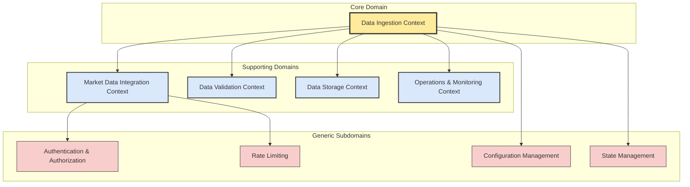
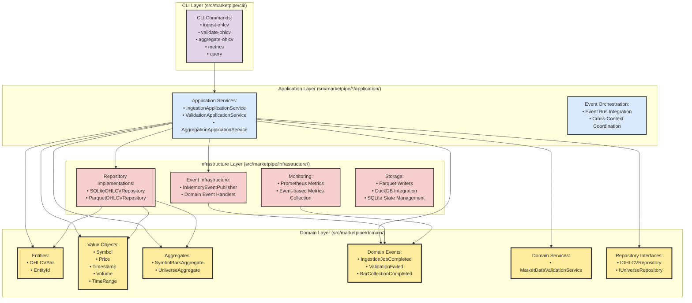
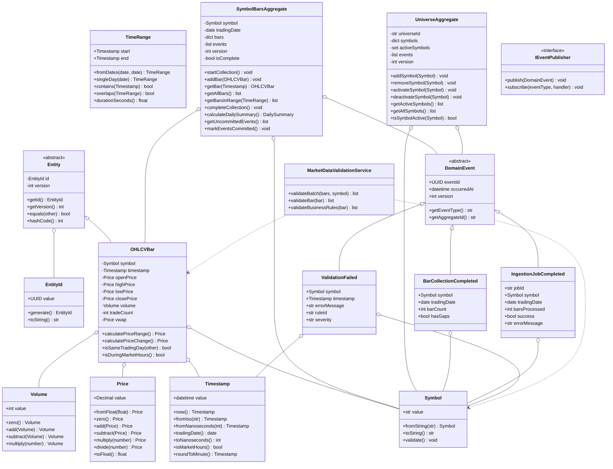
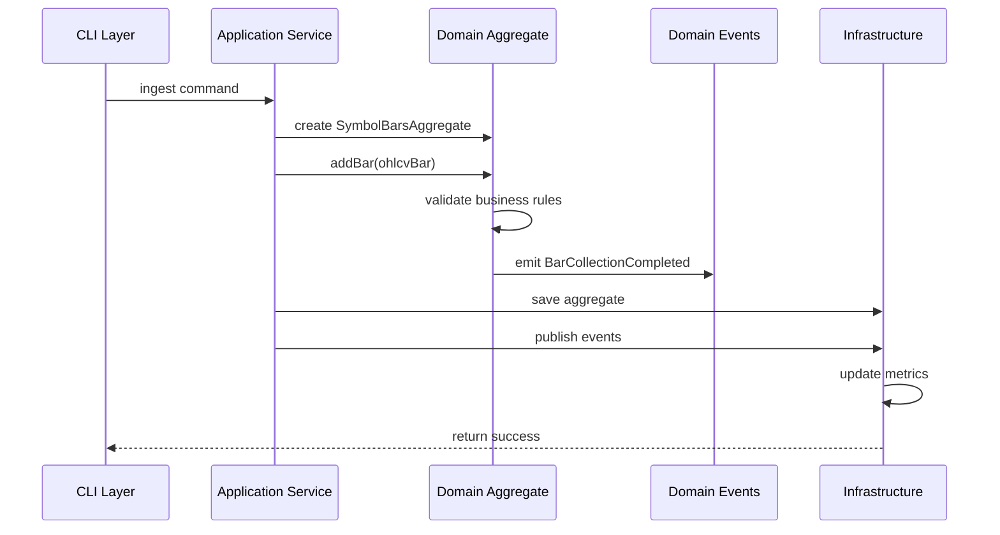
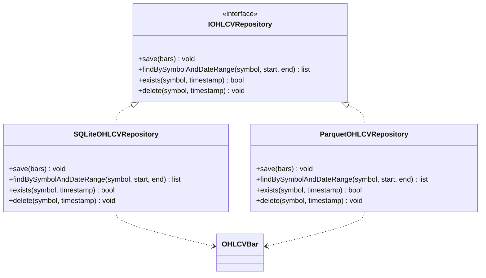

# MarketPipe Domain Model Diagrams

This document contains UML and Mermaid diagrams illustrating the Domain-Driven Design architecture of MarketPipe after the DDD refactor.

## Bounded Context Overview

## DDD Layer Architecture

## Domain Model Class Diagram

## Event Flow Diagram

## Repository Pattern

## Key DDD Principles Enforced

1. **Domain Purity**: Domain layer contains only business logic, no infrastructure dependencies
2. **Dependency Inversion**: Application layer depends on domain interfaces, infrastructure implements them
3. **Event-Driven Architecture**: Domain events enable loose coupling between bounded contexts
4. **Aggregate Boundaries**: Clear consistency boundaries around SymbolBarsAggregate and UniverseAggregate
5. **Repository Pattern**: Abstract data access behind domain interfaces
6. **Value Objects**: Immutable value objects for Symbol, Price, Timestamp, etc.
7. **Entity Identity**: Clear entity identity through EntityId value object
