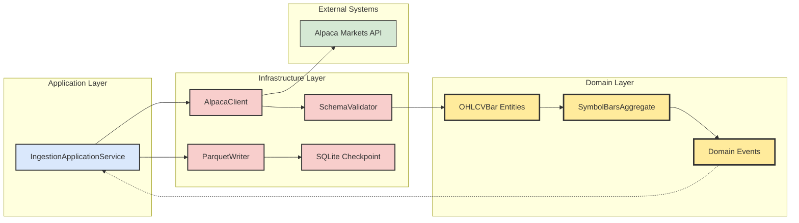

# Ingestion Pipeline

The ingestion pipeline follows Domain-Driven Design principles with clear separation 
between domain logic, application services, and infrastructure concerns. The flow 
demonstrates how market data moves through the layered architecture:



## Running the Pipeline

Run the ingestion pipeline from the project root:

```bash
# Using the new CLI structure
marketpipe ingest --provider alpaca --symbols AAPL,MSFT --start 2024-01-01 --end 2024-01-02

# Or using configuration file (legacy support)
marketpipe ingest --config config/example_config.yaml
```

This writes partitioned files following the Hive partitioning scheme:
`data/symbol=AAPL/year=2025/month=06/day=04.parquet`.

The compression format can be controlled via CLI flags or configuration files 
(supports `snappy`, `zstd`, and `lz4` codecs).

## Architecture Benefits

The DDD-based pipeline provides:

- **Domain Purity**: Business logic isolated in domain entities and aggregates
- **Event-Driven**: Domain events enable loose coupling between components  
- **Infrastructure Flexibility**: Market data providers can be swapped without affecting domain logic
- **Testability**: Each layer can be tested independently with clear boundaries
- **Observability**: Built-in metrics and event tracking throughout the pipeline

## Metrics

When metrics are enabled, the pipeline exposes Prometheus metrics on 
`http://localhost:8000/metrics`. Import `docs/grafana_dashboard.json` into 
Grafana to view request rate, errors, latency, and backlog. Use the Grafana 
UI's *Import Dashboard* feature and select the JSON file.

The metrics are collected at the infrastructure layer and published via 
domain events, maintaining clean separation of concerns.

