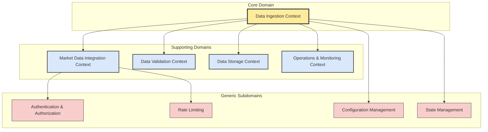
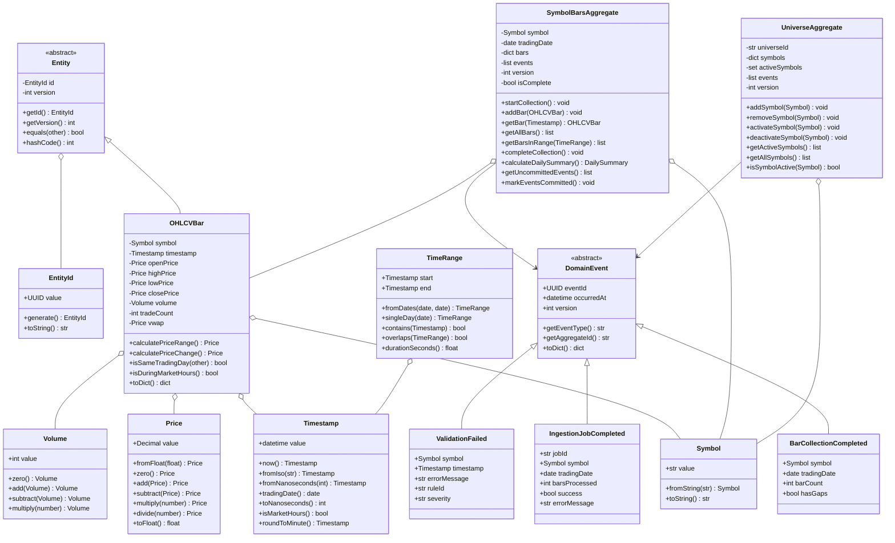
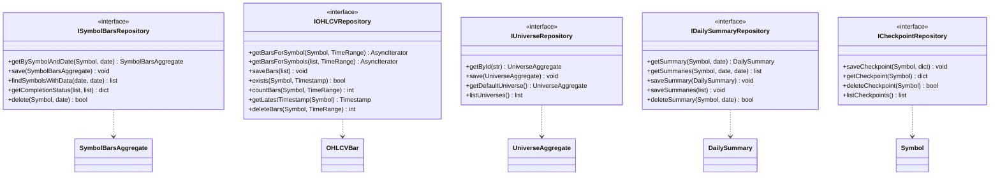
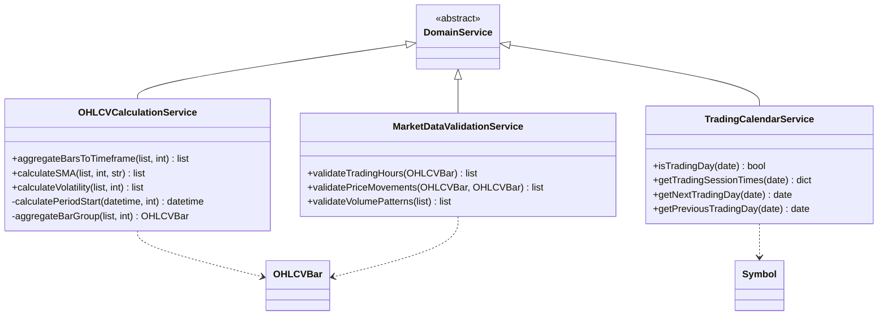
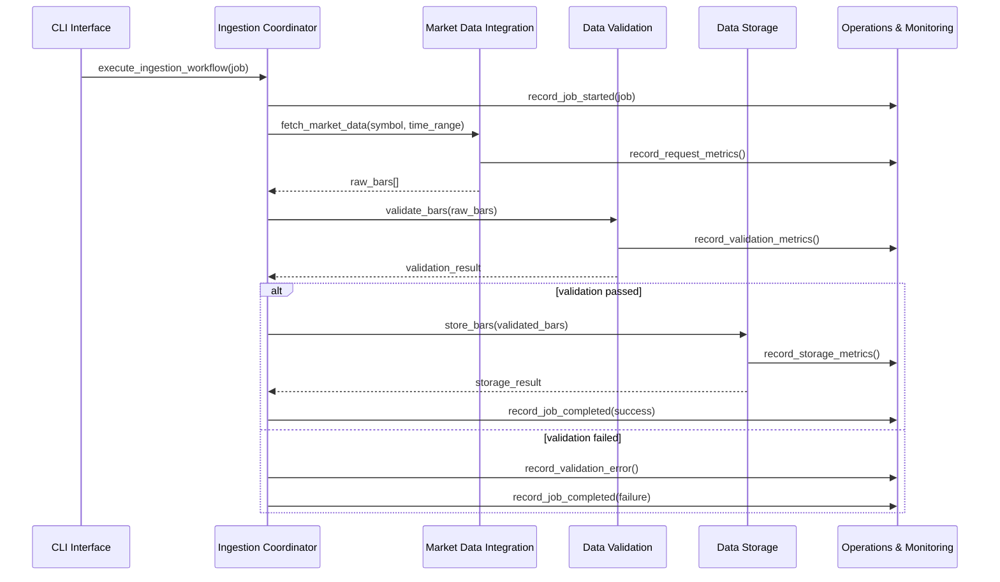
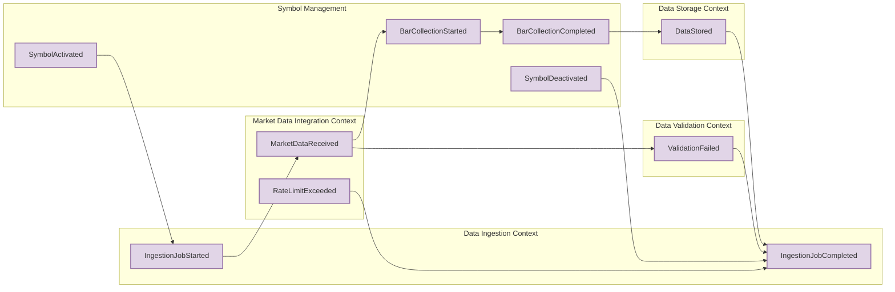
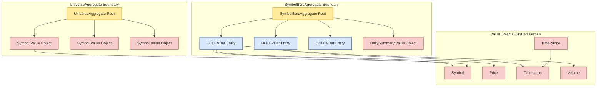
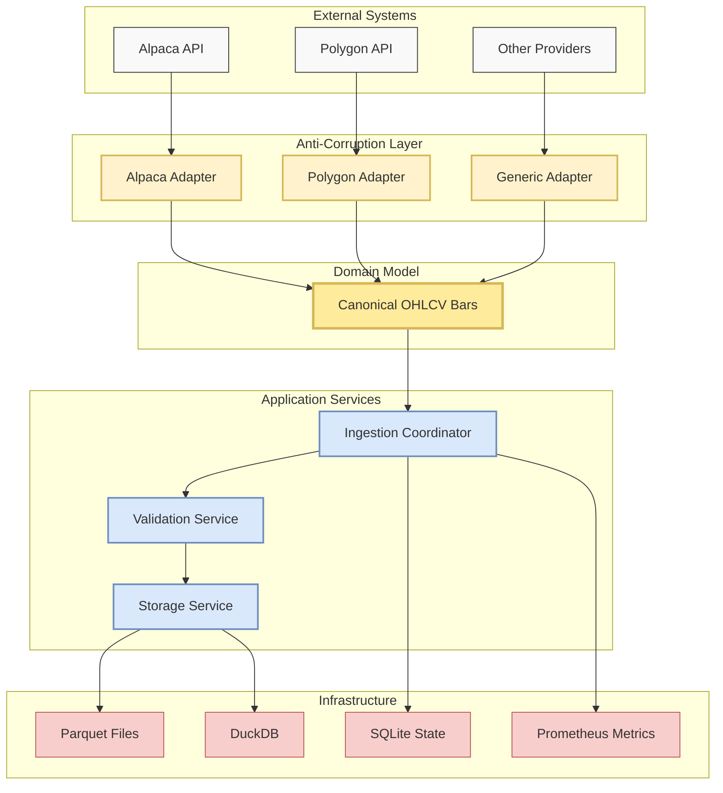

# MarketPipe Domain Model Diagrams

This document contains UML and Mermaid diagrams illustrating the Domain-Driven Design architecture of MarketPipe.

## Bounded Context Overview

## Domain Model Class Diagram

## Repository Interfaces

## Domain Services

## Context Integration Flow

## Event Flow Diagram

## Aggregate Boundaries

## Data Flow Architecture

These diagrams illustrate the key aspects of MarketPipe's Domain-Driven Design architecture:

1. **Bounded Context Overview**: Shows the relationship between core, supporting, and generic domains
2. **Domain Model Class Diagram**: Details the entities, value objects, and aggregates
3. **Repository Interfaces**: Shows the data access abstraction layer
4. **Domain Services**: Illustrates business logic services
5. **Context Integration Flow**: Sequence diagram showing cross-context communication
6. **Event Flow**: Shows how domain events flow between contexts
7. **Aggregate Boundaries**: Illustrates consistency boundaries and shared kernel
8. **Data Flow Architecture**: Shows the overall system architecture with anti-corruption layers